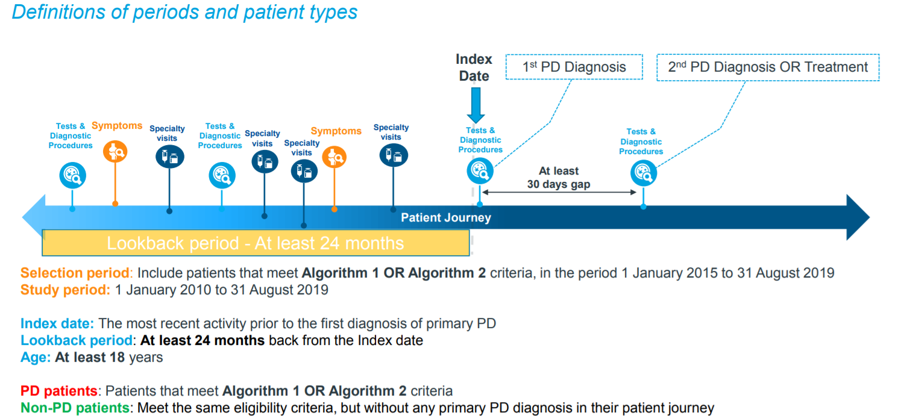

# AIML Disease Detection Pipeline - A Data Scientist's Primer

## Starting on a new disease

### [CDSW](http://usrhdpcdsw2.rxcorp.com/): Dolphin setup

1. Create a project on CDSW
2. Clone the [Dolphin git repository](http://rwes-gitlab01.internal.imsglobal.com/Prototypes/dolphin) in CDSW

    - On CDSW project click on `Open Workbench`
    - `Start New Session` with Python3 and click `Launch Session`
    - Open terminal by clicking on `>_Terminal access` and use the `git clone` as explained in [Basic git commands](../developer/git_guide.md)

      ```bash
      git clone --single-branch --branch release http://rwes-gitlab01.internal.imsglobal.com/Prototypes/dolphin.git
      ```

3. Navigate to `dolphin` folder by using command:

      ```bash
      cd ./dolphin/
      ```

4. At the root of the `dolphin` directory run:

      ```bash
      ./scripts/cdsw/setup_dolphin.sh
      ```

    This script will install and/or update `Julia` to the required version as well as all packages that are necessary to run `Dolphin`. It will also check for changes to the source code on the working branch and updated if there are any. If any change is made to the `Julia` or `Dolphin` source code, tests will be run to verify that everything is in working order.

### CDSW Github permissions

IQVIA's firewall policies prevent access to github through terminal. To bypass this limitation set git to use the `git:` instead of `https:` protocol, using the script below:

```bash
   git config --global url."git://".insteadOf https://
 ```

### Dolphin dependencies

 To install the Dolphin's Julia environment dependencies to the main Julia environment:

1. Run Julia
2. Press `]` to enter package manager (`Pkg`)
3. Run `add CSV` (or any package, to populate the main Julia environment)
This will add the CSV package to your main Julia environment.
You should now have a folder `$HOME/.julia/environments/v1.1`.
This folder should contain two files:
    - `Project.toml`
    - `Manifest.toml`

    These are used by the main Julia environment (v1.1). The dolphin repository maintains the list of all dependencies inside its own `Manifest.toml` and `Project.toml`. **You need to instantiate these packages in the main Julia environment**. Steps 4-11 describe how to do this.
4. Exit Julia (press backspace to exit package manager, then press Ctrl + D)
5. Copy `Manifest.toml` from dolphin's repo into the main folder to `$HOME/.julia/environments/v1.1`.
6. Enter edit mode for Dolpin's `Project.toml` file, found inside the Dolphin repo. You should see something like:

    ```bash
    name = "Dolphin"
    repo = "http://rwes-gitlab01.internal.imsglobal.com/Prototypes/dolphin"
    version = "0.1.0"

    [deps]
    Arrow = "69666777-d1a9-59fb-9406-91d4454c9d45"
    CSV = "336ed68f-0bac-5ca0-87d4-7b16caf5d00b"
    Colors = "5ae59095-9a9b-59fe-a467-6f913c188581"
    Coverage = "a2441757-f6aa-5fb2-8edb-039e3f45d037"
    DataFrames = "a93c6f00-e57d-5684-b7b6-d8193f3e46c0"
    Feather = "becb17da-46f6-5d3c-ad1b-1c5fe96bc73c"
    JSON = "682c06a0-de6a-54ab-a142-c8b1cf79cde6"
    MLDataUtils = "cc2ba9b6-d476-5e6d-8eaf-a92d5412d41d"
    OnlineStats = "a15396b6-48d5-5d58-9928-6d29437db91e"
    ProgressMeter = "92933f4c-e287-5a05-a399-4b506db050ca"
    PyCall = "438e738f-606a-5dbb-bf0a-cddfbfd45ab0"
    TOML = "191fdcea-f9f2-43e0-b922-d33f71e2abc3"
    Test = "8dfed614-e22c-5e08-85e1-65c5234f0b40"
    UnicodePlots = "b8865327-cd53-5732-bb35-84acbb429228"
    ```

    Copy all entries under `[deps]`.
7. Enter edit mode for `$HOME/.julia/environments/v1.1/Project.toml`. You should see something like the following (depending on which package you added in step 2):

    ```bash
      [deps]
      CSV = "336ed68f-0bac-5ca0-87d4-7b16caf5d00b"
    ```

    Under `[deps]`, paste from clipboard the entries copied from dolphin's `Project.toml` file in step 6.
8. From the terminal, run Julia and enter package manager (see Step 2)

9. From inside the package manager, run `instantiate`
10. FInally, Run `status`. You should now see a list of all packages required by dolphin, added in your main Julia environment.

### Hadoop authentication

From CDSW interface,

- go to `Account Settings` by clicking the drop-down menu on your username at the top-right of the screen.
- Select `Hadoop Authentication` tab

  **Username**: rwipmli@INTERNAL.IMSGLOBAL.COM
  
  **Password**: ask a data scientist or a big data engineer in the team

### Folder structure for a new disease

It is advisable to keep files for each disease organised separately. Note that, by default, the home directory on CDSW is located at `/home/cdsw/`.

The following is a suggested structure that could be used for a new disease (in this case the name of the disease is "hfpef") relative to the home directory:

- `configs/hfpef/`: For Dolphin configuration files
- `modelscripts/hfpef/`: For Python scripts used to analyse and preprocess the data etc.
- `data/hfpef/`:
  - `data/hfpef/original/`: For original PosNeg and Scoring data as provided by ETL
    - `data/hfpef/original/posneg_v1/`
    - `data/hfpef/original/scoring_v1/`
  - `data/hfpef/preprocessed/`: For preprocessed data to be consumed by Dolphin
    - `data/hfpef/preprocessed/posneg_v1/`
    - `data/hfpef/preprocessed/scoring_v1/`
  - `data/hfpef/output_of_some_model/`: For Dolphin output. NB: You do *not* need to actually create this; it will, automatically be created based on the settings in the configuration file (`data.directories.output` parameter)
  - `data/hfpef/predictions/`: For prediction files generated from Dolphin output
    - `data/hfpef/predictions/final_prediction_files`

NB: Above assumes that we are using version 1 of the cohorts. If other versions are used, adjust the paths accordingly.

## Data acquisition

The Data Scientist's involvement with the Disease Detection pipeline typically starts when the PosNeg and Scoring Cohorts are prepared by the ETL team and placed on the DRML server. This will typically be communicated via one of:

- E-mail
- Teams message (e.g. there is a dedicated "Disease Job Running" chat)
- Jira ticket (e.g. the "Platform Operationalisation" board)

The Data Scientist responsible for a particular disease pipeline needs to make sure that they are included in the relevant communication channels.

When ETL inform Data Scientists that the PosNeg and Scoring Cohorts are available on DRML they should provide the exact location of these files. Typically, this data will be found on HDFS at

`/production/rwi/data/mli/output/disease/{DISEASE NAME}/{COHORT NAME}/`

where `{DISEASE NAME}` and `{COHORT NAME}` would be supplied by ETL. Alternatively, it is possible to infer the path by exploring `/production/rwi/data/mli/output/disease/` using `hdfs dfs -ls` command from a CDSW terminal. Note that each cohort folder typically contains multiple csv files.

Files on DRML can also be accessed using a graphical interface (HUE): <https://usrhdphue.rxcorp.com:8889/hue/accounts/login/?next=/hue/> (user: `rwipusr`, password: to be provided)

Assuming the folder structure has been created on CDSW and the location of the data has been specified, the files can be copied from HDFS to CDSW using `hdfs dfs -get <source> <target>` command (from a terminal). For example, the following would copy version 2 of HFpEF PosNeg cohort from HDFS to CDSW using the folder structure above:

```bash
hdfs dfs -get /production/rwi/data/mli/output/disease/hfpef/octopus_novartis_generic_hfpef_posneg_v2/*.csv /home/cdsw/data/hfpef/posneg_v2/
```

## Data verification

Once the data is obtained, it is advisable to verify it with the product owners and the clinical team. Typically, we confirm:

- the sizes of the cohorts,
- the number of positive cases in the PosNeg cohort,
- the number of features that will be ingested by Dolphin,
- the list of clinical events from which the features were generated.

ETL splits cohorts in smaller files (~2GB each). As general rule, make sure that the number of fetched files matches the source using `hdfs dfs -ls <source>`, e.g.:

```bash
hdfs dfs -ls /production/rwi/data/mli/output/disease/hfpef/octopus_novartis_generic_hfpef_posneg_v2/
```

## Data preparation

The data that is obtained from ETL needs to be preprocessed before it is suitable to be consumed by Dolphin. Currently the following preprocessing is carried out:

- features associated with CC02 events are dropped
- the following columns are also dropped: "lrx_flag", "dx_flag", "lookback_dys",
"lookback_mnths", "lookback_dt", "back_dt", "frst_rx_clm_dt", "frst_dx_clm_dt",
"lst_rx_clm_dt",  "lst_dx_clm_dt", "disease_frst_exp_dt","index_dt"

In the above steps, redundant or non-important events as acclaimed by the clinical experts are dropped. Take time to discuss and familiarise yourself with the nature of patient record events. See an example for Parkinson's disease below:



The Scoring Cohort is typically orders of magnitude larger than the PosNeg cohort and it is not
necessary to preprocess it before the model is run (but it should be done by the time model training is complete). For this reason we typically preprocess PosNeg and Scoring Cohorts separately.

The sample script for preprocessing can be found [on Pythia](http://rwes-gitlab01.internal.imsglobal.com/Prototypes/Pythia/blob/develop/snippets/disease_detection/preprocess_raw_data.py). Two copies, one for each cohort, can be saved in `modelscripts/{DISEASE}/` folder as described above and paths modified as necessary.

## Model training

The model is trained using Dolphin (see [Dolphin User Guide](http://rwes-gitlab01.internal.imsglobal.com/Prototypes/dolphin/blob/develop/doc/user/USER_GUIDE.md) for details).

**Dolphin** has two modes of operation, one for model training and the second for visualisation of various model parameters. Latter is also run at the end of the training mode.

### Training with Dolphin requires

1. the preprocessed PosNeg cohort;
2. a `.toml` configuration file (normally attached to the relevant jira sprint ticket - **see how to cinfigure in the section below**)
3. A python script: Normally, that would be [`run_julia_pipeline.py`](http://rwes-gitlab01.internal.imsglobal.com/Prototypes/dolphin/blob/develop/run_julia_pipeline.py).  The script passes 1 and 2 as arguments to **Dolphin** and activates _training mode_ with the flag `-c` as follows:

```bash
julia --color=yes --project=. "./src/Dolphin.jl" -c {relative/path/to/configuration/file}
```

### Configuration file

The configuration file should be attached to the relevant jira ticket. The following typically need to be customised for a new model:

| Configuration file parameters |  |
|------------------------------|-------------------------------------------------------------------------------------------------------------------------------------------------------------------------------------------------------------------------------------------------------------------------------------------------------|
| `[project]` | should accurately describe the model |
| `[data.data_source_info]` | should specify the HDFS path where the PosNeg cohort was obtained and the number of csv files that comprosied the PosNeg data set. The `comment` field should state "HDFS DRML". |
| `[data.directories]` | should use the preprocessed PosNeg cohort as an input and specify the output path for the model |
| `[optimiser.max_evals]` | varies. If POs need a proof-of-concept model with a quick turnaround `max_evals = 1` can be used. Otherwise, typical values are 25, 40, 50, 75. **Check your ticket's instruction on setting this value.** |
| `[model_params]`: |  |
| `[model_params.num_threads]` | should reflect the number of vCPUs used by the CDSW session where the model is run |
| `max_evals` | then LightGBM parameters should be specified explicitly to avoid Hyperopt making an arbitrary choice. Thus when using example configuration files from previous projects, take care to use those from other projects with `max_evals = 1`. **Check your ticket's instruction on setting this value.** |

The configuration file to be used can be saved in `configs/{DISEASE}/` folder as described above and modified as necessary.

### Run training job

To finally train your model,

- Create a Job on CDSW with the `dolphin/run_julia_pipeline.py`
- In `settings`, choose an Engine Profile where the number of `vCPUs`  reflects the value of `num_threads` in the configuration file
- In `settings`, click on `Set Environmental Variables` (under GPUs) and add an enviromental variable with `name: CONFIG`  and pass the directory for the configuration file in `value: path/to/config/file` e.g `/home/cdsw/dolphin/examples/example/config.toml`.
- Run the job

## Prediction generation

The ETL pass information about diagnosed and predicted patients (by our model) to UI using a `prediction.csv` file. This file contains data about all the diagnosed patients and all the patients from the scoring cohort, predicted as positive by the model The `prediction.csv` is a file that (currently) contains 5 columns:

- `patient_id`
- `pat_gender`
- `pat_age`
- `index_dt` (index date)
- `label` (`1` indicates a positive patient (from the pos_neg cohort), `0` indicates a patient from the scoring cohort, i.e. not diagnosed)
- `prediction` (`1` indicates a patients predicted as positive by the model, `0` indicates a patient not predicted as positive by the model).

We generate the prediction file in several steps, described below.

### Create predicted probabilities for the Scoring Cohort

Once Dolphin completes, the model will be saved in a `model_{PIPELINE_ID}.txt` file in the output path specified in the configuration file. This can then be used to generate predictions for the Scoring Cohort. Use [the sample script](http://rwes-gitlab01.internal.imsglobal.com/Prototypes/Pythia/blob/develop/snippets/disease_detection/predict_scoring_cohort.py) to generate the predicted probabilities. The sample script should be saved in `modelscripts/{DISEASE}/` folder as described above and manually modified to specify the paths used by the script.

### Decide on a precision target

The predicted probabilities then need to be converted to actual binary prediction. To do that we need to specified a threshold that would separate the predicted probabilities into positive and negative predictions. Depending on the choice of the threshold, the precision of the model will change. We tend to target high precision (~85%) but if that results in a very low or very high number of predicted patients we adjust the precision level. Therefore, we need to set the precision level by consulting with the clinical team before the final prediction file can be produced.

A [sample script](http://rwes-gitlab01.internal.imsglobal.com/Prototypes/Pythia/blob/develop/snippets/disease_detection/thresholds.py) is used to produce information necessary for the clinical team to provide their feedback. A copy can be saved in `modelscripts/{DISEASE}/` folder as described above and manually modified to specify:

- the paths used by the script
- `diagnosed_num` - the number of positive labels in the PosNeg Cohort
- `target_precisions` - the list of precision values that we wish to consider (typically these are 75%,80%, 85%, 90%, 95% and 99%)

When the script is run it will produce, for each target precision level,

- the threshold that would give this precision;
- the number of positive patients in the Scoring Cohort that the model would predict; and
- the total number of positive patients that we obtain between PosNeg and Scoring Cohorts.

The number of positive patients (predicted and overall) and the model performance measured as its average precision should be circulated to the clinical team and the product owner (no need to circulate the thresholds). The clinical team/POs will advise which precision level we should target based on which numbers most closely match the prevalence levels observed in reality.

Once the precision level is fixed, the threshold to be used for the prediction file is then determined.

### Determine diagnosed positives from the PosNeg Cohort

For the PosNeg Cohort we do not need to obtain any predictions. We only need to identify which patients in the cohort have been diagnosed as positive. The sample script for this can be found [here](http://rwes-gitlab01.internal.imsglobal.com/Prototypes/Pythia/blob/develop/snippets/disease_detection/create_prediction_file_positives.py) and can saved in `modelscripts/{DISEASE}/` folder as described above and manually modified to specify the paths.

### Create final prediction file

For the Scoring Cohort, predictions can be obtained once the threshold is set, as above. Then the diagnosed patients from the PosNeg Cohort and the predicted patients from the Scoring Cohort need to be combined into a single prediction file in a specified format. The sample script for this can be found [here](http://rwes-gitlab01.internal.imsglobal.com/Prototypes/Pythia/blob/develop/snippets/disease_detection/create_final_prediction_file.py). The sample script should be saved in `modelscripts/{DISEASE}/` folder as described above and manually modified to specify the paths used by the script.

The prediction file will always be saved as `prediction.csv`. Therefore if multiple models are run on the same input data, separate folders can be created under `data/hfpef/predictions/final_prediction_files` for different models to differentiate these.

### Upload the prediction file

Once the prediction file is created it needs to be uploaded to HDFS using `hdfs dfs -put <source> <target>` command. The typical location for prediction files is `/production/rwi/data/mli/input/disease/{DISEASE NAME}/{MODEL NAME}/prediction.csv`.

`{MODEL NAME}` is arbitrary. We usually assign it a version number. So the first model for the disease is, for example `v1`.

Once the prediction file is uploaded (which can be verified by using `hdfs dfs -ls`) the upload path needs to be circulated to the ETL team.
